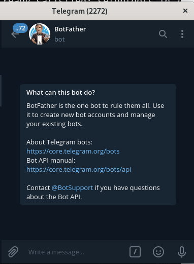
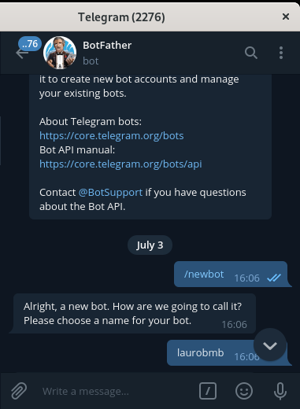
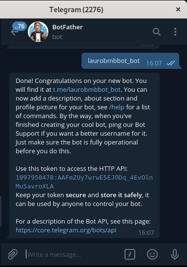
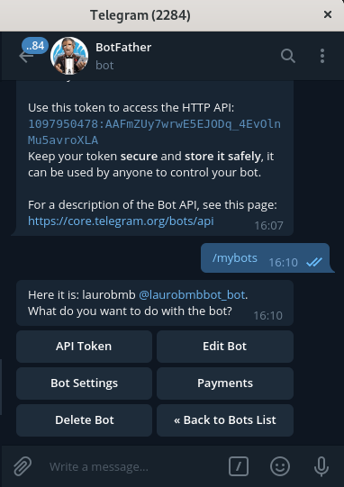

### Bot Telegram on python3

Este bot no telegram serve para testar as funcionalidades de machine learning 

> 	O ChatterBot é uma biblioteca Python que facilita a geração de respostas 		automatizadas às informações de um usuário. O ChatterBot usa uma seleção de algoritmos de aprendizado de máquina para produzir diferentes tipos de respostas. Isso facilita para os desenvolvedores criar bots de bate-papo e automatizar conversas com os usuários. Para mais detalhes sobre as idéias e conceitos por trás do ChatterBot, consulte o diagrama de fluxo do processo.

fonte: [chatterbot]([https://chatterbot.readthedocs.io/en/stable/)

######  Para criação de bots no Telegram use o usuário @BotFather [botfather](https://telegram.me/BotFather), nele você vai copiar o token do seu BOT 

Necessário de exportar a variável com o token do bot no sistema operacional

> export TOKEN="1097950478:AAFmZUy7wrwE5EJODq_4EvOlnMu5avroXLA"

Defina também a variável com o nome do BOT, exporte a variável NOMEBOT, como exemplo:

> NOMEBOT="Magali"

##### Para o build 

> podman build -t bot:v1.0 .

##### Para execução 

>podman run -it -e TOKEN="1097950478:AAFmZUy7wrwE5EJODq_4EvOlnMu5avroXLA" -e NOMEBOT="Magali" localhost/bot:v10.0

#####  Para customizar seu bot no TELEGRAM use o menu de adminsitração do @botfather [botfather](https://telegram.me/BotFather)

### Documentações usadas para criação do BOT

[python-telegram-bot](https://pypi.org/project/python-telegram-bot/)

[Telegram APIs](https://core.telegram.org/)

[nltk](http://www.nltk.org/)

[Chatterbot](https://chatterbot.readthedocs.io/en/stable/)
